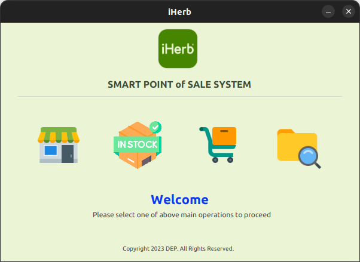
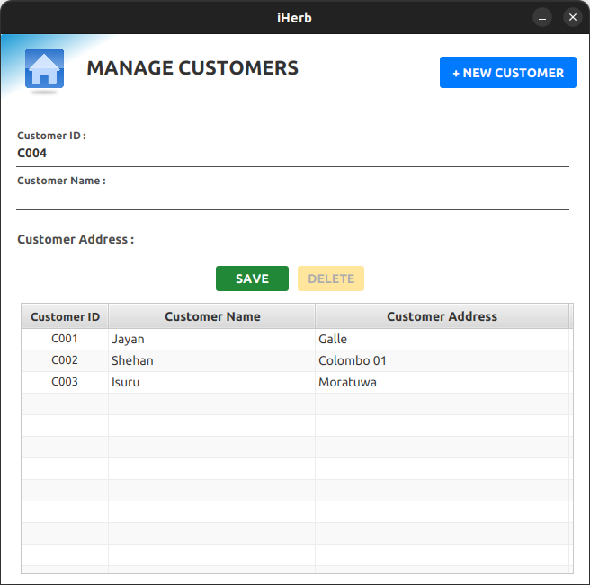
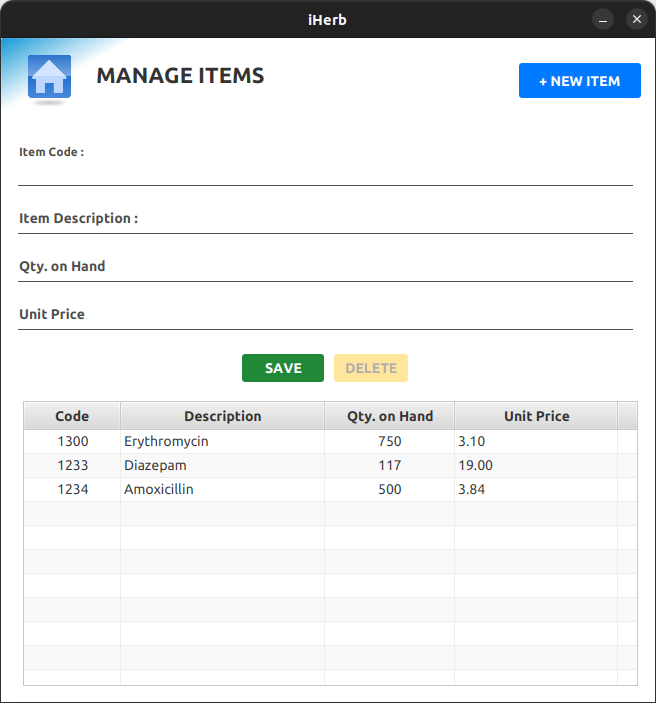
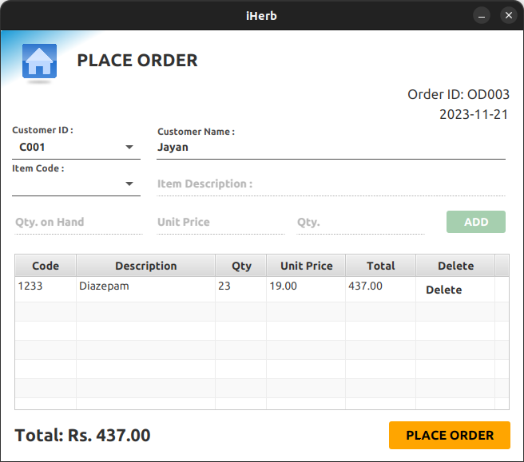
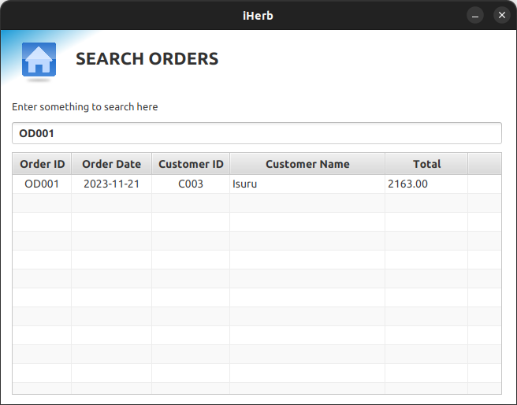

# IHerb (POS) System

### License
Copyright &copy; 2023 Isuru Ashinsana. All Rights Reserved. 


## Overview

This Point of Sale (POS) system is a Java-based application developed using Java and JavaFX for the user interface. It utilizes a PostgreSQL database to store and manage product information, sales transactions, and customer data.
This robust technology stack ensures a seamless and efficient solution, integrating advanced features to streamline transactions and enhance the overall operational capabilities for the company.


## Sections

### 1. Customer Section

- Manage customer information for loyalty programs and personalized service.
  


### 2. Item Section

- Add, edit, and delete product information.
- Track product availability and stock levels.
  


### 3. Order Section

- Process sales transactions efficiently.
- Generate receipts for customers.
  

### 4. Search Order Section

- Search for specific items, customers, or orders easily.
  


## Features

1. **User-friendly Interface:** The POS system provides an intuitive and user-friendly interface for easy navigation.

2. **Reporting:**
    - Add customers to database
    - Add Items to database 
    - Place orders and develop jasper reports 
    - Retrieve place order details through search bar 


### Setup

1. Clone the repository:
   ```bash
   https://github.com/IsuruAshi/iHerb_POS_System.git


